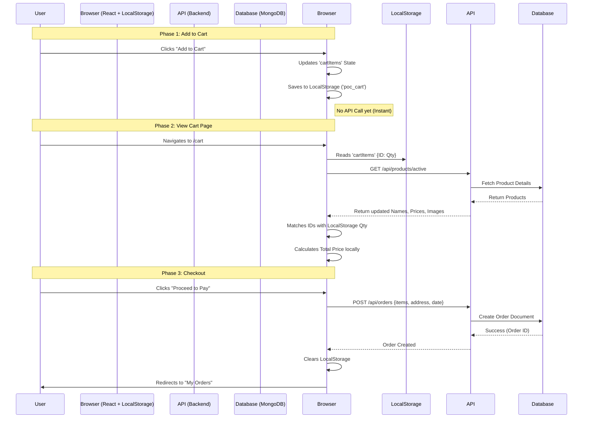

# Cart Workflow & Architecture - Pride of Cows

---

## 🟢 Slide 1: System Overview

**Title**: E-Commerce Cart System Architecture
**Approach**: Hybrid Client-Server Model

**Key Concept**:
The cart operates primarily on the **Client-Side (Browser)** for instant feedback and performance, syncing with the **Backend Server** only during determining product prices and final order placement.

---

## 🟢 Slide 2: Workflow Diagram



---

## 🟢 Slide 3: Phase 1 - Adding to Cart

**Action**: User clicks "Add to Cart" or "+" button.

**Mechanism**:
1.  **State Update**: React Context (`CartContext`) updates the internal state object:
    *   `{ "product_id_1": 2, "product_id_2": 1 }`
2.  **Persistence**: The state is immediately saved to the browser's **localStorage** under the key `poc_cart`.
3.  **Benefit**: Even if the user refreshes the page or closes the browser, their cart remains saved without needing a database write yet.

---

## 🟢 Slide 4: Phase 2 - Viewing the Cart

**Action**: User visits the `/cart` page.

**Mechanism**:
1.  **Hydration**: The page reads the stored IDs and Quantities from LocalStorage.
2.  **Live Price Check**: The frontend makes an API call to `fetchProducts(true)`.
    *   *Why?* To ensure the user sees the **current live price** and stock status, not an old price saved in local storage.
3.  **Calculation**:
    *   `Total = (Live Product Price) × (Stored Quantity)`
    *   This happens instantly on the client side.

---

## 🟢 Slide 5: Phase 3 - Order Placement

**Action**: User confirms address and clicks "Pay".

**Mechanism**:
1.  **Payload Creation**: Frontend constructs the final order object:
    ```json
    {
      "items": [{ "productId": "...", "quantity": 2, "price": 500 }],
      "address": "123 Green Street...",
      "totalAmount": 1000
    }
    ```
2.  **API Transaction**: Sends `POST` request to `/api/orders`.
3.  **Validation**: Backend verifies the data (address presence, valid totals).
4.  **Completion**: On success, the frontend **clears the cart** completely to prevent re-ordering.

---

## 🟢 Slide 6: Backend Architecture

**Files Involved**:
*   **Controller**: `controllers/orderController.js`
    *   Handles validation and logic.
*   **Model**: `models/Order.js`
    *   Defines structure: `userId`, `items`, `status`, `deliveryDate`.
*   **Database**: MongoDB
    *   Stores the permanent record of the transaction.

---
